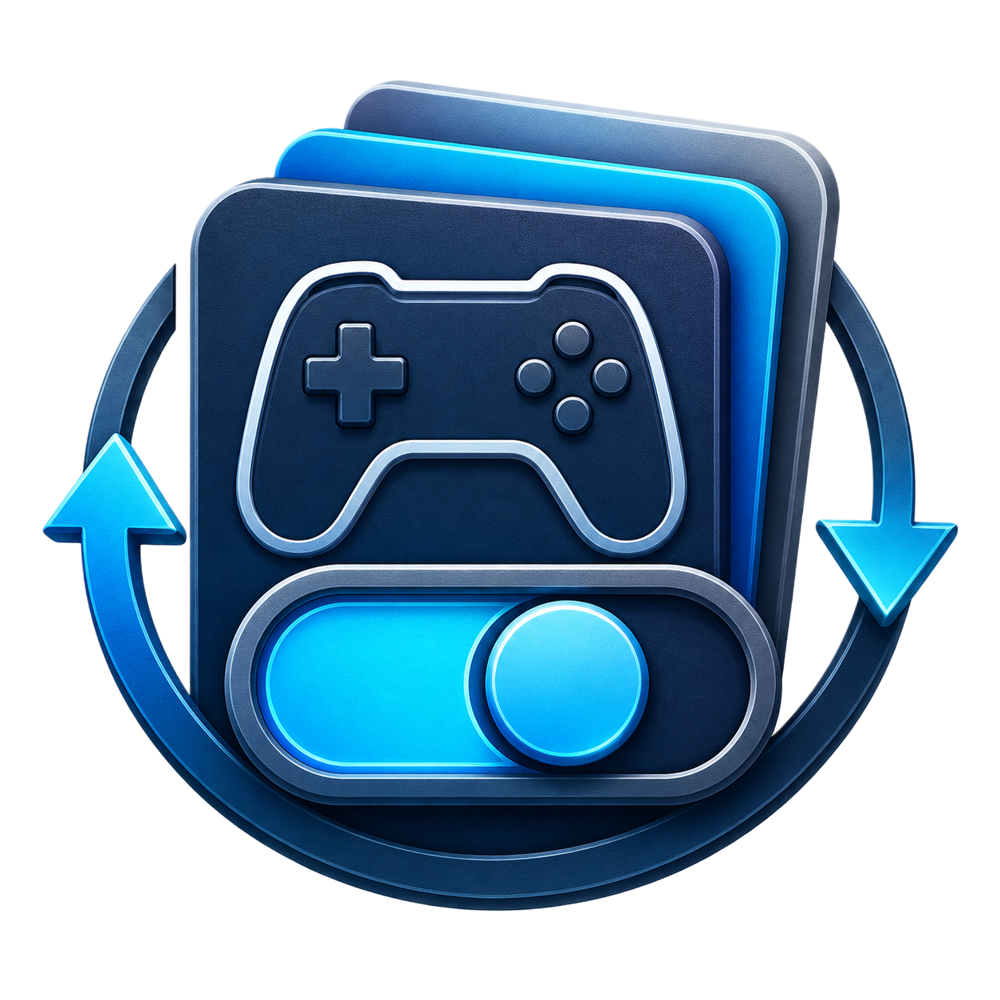

# PRO Mod Manager

A native Windows mod profile manager for quickly switching game mod sets with a clean desktop workflow.

## Downloads

- **Installer (recommended):** `PRO_Mod_Manager_Setup.exe`
- **Portable app:** `PRO_Mod_Manager_Native.exe`

## What It Does

- Create and switch between mod profiles
- Activate/deactivate mods by profile
- Move mod files safely between repository and game folder
- Track active mods and profile state in one local JSON state file
- Optional profile-themed background art while online

## Why This Build

This repository is intentionally minimal and release-focused:

- Final app executable
- Final installer executable
- Product website and documentation

No prototype code or unrelated files are included.

## Install

1. Run `PRO_Mod_Manager_Setup.exe`
2. Choose install directory
3. Launch **PRO Mod Manager**
4. Set your Game Folder and Mod Repository
5. Initialize and start managing profiles

## Portable Mode

If you prefer no install wizard, run `PRO_Mod_Manager_Native.exe` directly.

## Data Storage

The app writes runtime data locally near the app installation:

- `mod_manager_state.json`
- `profile_background_cache/`

## Website

Project page is in `docs/` and is ready for GitHub Pages.

---

Built for fast, practical mod management on Windows.
